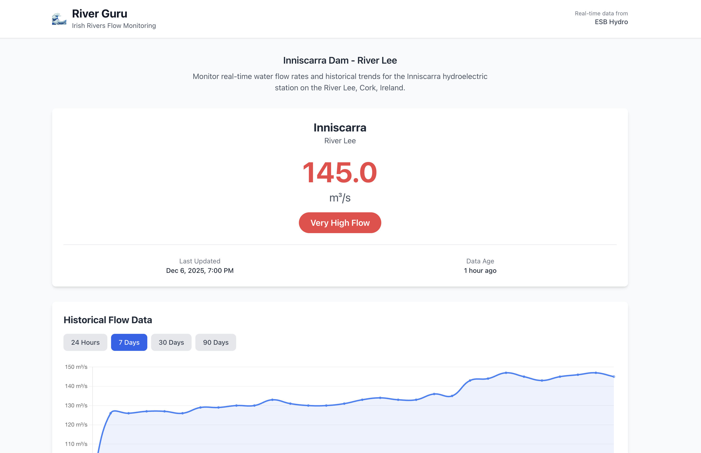

# Irish Rivers Data Scraper & River Guru Web App

A low-cost, serverless system for aggregating water data from Irish rivers, including flow rates from ESB Hydro and water level/temperature data from waterlevel.ie.

## Screenshots



*River Guru displays real-time data from Inniscarra Dam (flow) and Waterworks Weir (water level & temperature) with interactive historical charts*

## Features

### Data Collection (✅ Complete)
- **Multiple Data Sources**: ESB Hydro flow data (PDF) and waterlevel.ie water level/temperature (CSV API)
- **Serverless Architecture**: Runs on AWS Lambda with minimal operating costs (<$5/month)
- **Automatic Data Collection**: Scheduled hourly data scraping at 30 minutes past the hour
- **Robust Error Handling**: Exponential backoff retry logic for transient failures
- **Structured Logging**: CloudWatch-compatible JSON logs
- **S3 Storage**: Cost-effective data storage with automatic tiering
- **Extensible Design**: Easy to add new data sources

###  River Guru Web App (✅ Complete)
- **Mobile-First Vue.js SPA**: Responsive single-page application
- **Multi-Station Display**: Side-by-side view of Inniscarra flow and Waterworks Weir water level
- **Real-Time Flow Display**: Current flow rate with color-coded status indicators
- **Water Level & Temperature**: Real-time water level and temperature monitoring
- **Interactive Charts**: Historical data visualization (24h, 7d, 30d views)
- **Hourly Data Collection**: Backend automatically collects data every hour at 30 minutes past
- **AWS Hosted**: Static site on S3
- **Integrated Deployment**: Single Makefile command deploys both backend and frontend

## Architecture

###  Data Collection
```
EventBridge → Lambda (Python) → S3 Storage
    ↓              ↓                ↓
  Hourly       Parsers:         - Raw Files (PDF/CSV)
  Trigger      • ESB PDF        - Parsed JSON
               • Waterlevel.ie  - Aggregated Data
               + Retry Logic
```

###  River Guru Web App
```
┌──────────────┐
│   Users      │
│ (Mobile/Web) │
└──────┬───────┘
       │ HTTPS
       ↓
┌──────────────────────────────┐
│     CloudFront (CDN)         │
└──────┬──────────────┬────────┘
       │              │
       │ Vue.js SPA   │ API Calls
       ↓              ↓
┌─────────────┐  ┌──────────────────┐
│ S3 Bucket   │  │  API Gateway     │
│ (Static)    │  └────────┬─────────┘
└─────────────┘           │
                          ↓
                   ┌──────────────┐
                   │   Lambda     │
                   │  (Data API)  │
                   └──────┬───────┘
                          │
                          ↓
                   ┌──────────────┐
                   │  S3 Bucket   │
                   │ (Flow Data)  │
                   └──────────────┘
```

## Project Structure

```
river-data-scraper/
├── README.md                     # Main documentation
├── LICENSE                       # MIT License
├── CONTRIBUTING.md               # Contribution guidelines
├── DEPLOYMENT_GUIDE.md           # Deployment instructions
├── Makefile                      # Build automation
├── deploy.sh                     # Deployment script
├── template.yaml                 # CloudFormation/SAM template
├── samconfig.toml                # SAM configuration
├── requirements.txt              # Production dependencies
├── requirements-dev.txt          # Development dependencies
├── .env.example                  # Environment variables template
├── .gitignore                    # Git ignore patterns
│
├── src/                          # Python Lambda functions
│   ├── lambda_handler.py         # Data collector Lambda entry point
│   ├── config/
│   │   └── settings.py           # Configuration management
│   ├── connectors/
│   │   └── http_connector.py     # HTTP download logic
│   ├── parsers/
│   │   ├── esb_hydro_parser.py   # ESB PDF parsing logic
│   │   └── waterlevel_parser.py  # waterlevel.ie CSV parsing
│   ├── storage/
│   │   └── s3_storage.py         # S3 operations
│   └── utils/
│       ├── logger.py             # Structured logging
│       └── retry.py              # Retry with backoff
│
├── api/                          # Data API Lambda
│   ├── data_api.py               # RESTful API handler
│   └── requirements.txt          # API dependencies
│
├── web/                          # Vue.js web application
│   ├── src/
│   │   ├── App.vue               # Main app component
│   │   ├── main.js               # Vue entry point
│   │   ├── components/
│   │   │   ├── FlowStatus.vue    # Current flow display
│   │   │   ├── FlowChart.vue     # Historical flow chart
│   │   │   ├── WaterLevelStatus.vue  # Water level/temp display
│   │   │   └── WaterLevelChart.vue   # Water level/temp charts
│   │   ├── services/
│   │   │   └── api.js            # API client
│   │   └── utils/
│   │       └── date.js           # Date formatting
│   ├── public/                   # Static assets
│   ├── .env.example              # Web app env template
│   ├── package.json              # Node dependencies
│   ├── vite.config.js            # Vite configuration
│   └── tailwind.config.js        # Tailwind CSS config
│
├── tests/                        # Python tests
│   ├── test_*.py                 # Unit tests
│   └── api/
│       └── test_data_api.py      # API tests
│
├── events/                       # Test events for SAM
│   └── scheduled-event.json      # EventBridge test event
│
└── docs/                         # Documentation
    ├── PROJECT_CONTEXT.md        # Project context for AI/developers
    ├── screenshots/              # App screenshots
    └── history/                  # Archived documentation
        ├── planning/             # Original planning docs
        └── *.md                  # Phase completion notes
```

## Prerequisites

- Python 3.9 or higher (Lambda runtime: python3.9)
- AWS Account (for deployment)
- pip and virtualenv

## Local Development Setup

### 1. Clone the repository

```bash
git clone <repository-url>
cd river-data-scraper
```

### 2. Create virtual environment

```bash
python -m venv venv
source venv/bin/activate  # On Windows: venv\Scripts\activate
```

### 3. Install dependencies

```bash
# Production dependencies
pip install -r requirements.txt

# Development dependencies (includes testing tools)
pip install -r requirements-dev.txt
```

### 4. Configure environment

```bash
# Copy example environment file
cp .env.example .env

# Edit .env with your configuration
nano .env  # or use your preferred editor
```

### 5. Run tests

```bash
# Run all tests
pytest

# Run with coverage report
pytest --cov=src --cov-report=html

# Run specific test file
pytest tests/test_http_connector.py -v
```

## Configuration

### Environment Variables

All configuration is managed through environment variables. See [.env.example](.env.example) for all available options.

Key settings:

| Variable | Description | Default |
|----------|-------------|---------|
| `ENVIRONMENT` | Environment name (development/production) | `production` |
| `LOG_LEVEL` | Logging level (DEBUG/INFO/WARNING/ERROR) | `INFO` |
| `DATA_SOURCES_JSON` | JSON array of data sources | Inniscarra station |
| `RETRY_MAX_ATTEMPTS` | Maximum retry attempts | `3` |
| `CONNECTION_TIMEOUT` | HTTP timeout in seconds | `30` |
| `S3_BUCKET_NAME` | S3 bucket for data storage | (required) |

### Data Sources Configuration

Configure data sources using the `DATA_SOURCES_JSON` environment variable:

```json
[
  {
    "station_id": "inniscarra",
    "name": "Inniscarra Dam",
    "river": "River Lee",
    "url": "http://www.esbhydro.ie/Lee/04-Inniscarra-Flow.pdf",
    "source_type": "pdf",
    "enabled": true
  },
  {
    "station_id": "lee_waterworks",
    "name": "Waterworks Weir",
    "river": "River Lee",
    "url": "https://waterlevel.ie/data/day/19102_{sensor}.csv",
    "source_type": "api",
    "enabled": true
  }
]
```

**Note**: For waterlevel.ie stations, use `{sensor}` as a placeholder in the URL. The system will automatically fetch data for sensor 0001 (water level) and sensor 0002 (temperature).

## Usage

### Local Testing

```python
from src.config.settings import Settings
from src.connectors.http_connector import HTTPConnector

# Load configuration
settings = Settings.from_env()

# Create HTTP connector
connector = HTTPConnector(settings.connection)

# Download PDF
content, hash = connector.download_file(
    "http://www.esbhydro.ie/Lee/04-Inniscarra-Flow.pdf"
)

print(f"Downloaded {len(content)} bytes, hash: {hash}")
```

### Running the Lambda Handler Locally

```python
from src.lambda_handler import lambda_handler

# Simulate Lambda invocation
event = {}
context = type('Context', (), {'request_id': 'test-123'})()

response = lambda_handler(event, context)
print(response)
```

## AWS Deployment

### 🚀 Unified Deployment 

This project uses a **Makefile-based unified deployment** that handles both backend infrastructure (SAM) and frontend web app deployment in a single command.

```bash
# Deploy everything to production (backend + web app)
make deploy-prod

# Deploy to development
make deploy-dev

# Deploy to staging
make deploy-staging

# Or use the deploy script
./deploy.sh production
```

**Available Make Commands:**

```bash
make help                # Show all available commands
make build               # Build both Lambda functions and Vue.js app
make deploy              # Build and deploy everything
make deploy-prod         # Deploy to production
make deploy-dev          # Deploy to development
make test-api            # Test API endpoints
make validate            # Validate SAM template
make logs ENV=production # Tail Lambda logs
make dev-web             # Start web app dev server
make clean               # Clean build artifacts
```

### What Gets Deployed

The unified deployment creates:

**Backend Infrastructure (via SAM):**
- ✅ Lambda Functions (Data Collector + Data API)
- ✅ S3 Bucket for river data (with encryption and lifecycle)
- ✅ API Gateway REST API (with CORS)
- ✅ EventBridge Rule (cron-based scheduling)
- ✅ IAM Roles (with least-privilege permissions)
- ✅ CloudWatch Logs (30-day retention)
- ✅ CloudWatch Alarms (error monitoring)

**Frontend Web App:**
- ✅ Vue.js SPA built with Vite
- ✅ Deployed to S3 static hosting
- ✅ Connected to API Gateway

### Manual Deployment (Advanced)

If you prefer to deploy components separately:

```bash
# Backend only
sam build && sam deploy --config-env production

# Web app only
cd web && npm run build
aws s3 sync dist/ s3://river-guru-web-production/ --region eu-west-1 --delete
```

### 🌐 Current Production Deployment

The application is currently deployed to AWS in the `eu-west-1` region:

**Stack Name**: `river-data-scraper-prod`

**Live URLs**:
- **Web App**: http://river-guru-web-production.s3-website-eu-west-1.amazonaws.com
- **API Gateway**: https://3su2ubk6j2.execute-api.eu-west-1.amazonaws.com/production

**Deployed Resources**:
- **Data Collector Lambda**: `river-data-scraper-prod-collector`
- **Data API Lambda**: `river-data-scraper-prod-data-api`
- **Data S3 Bucket**: `river-data-ireland-prod`
- **Web App S3 Bucket**: `river-guru-web-production`
- **Schedule**: At 30 minutes past every hour (`cron(30 * * * ? *)`) - UTC time
- **Region**: `eu-west-1` (Ireland)

**AWS Console Links**:
- [Data S3 Bucket](https://s3.console.aws.amazon.com/s3/buckets/river-data-ireland-prod)
- [Web S3 Bucket](https://s3.console.aws.amazon.com/s3/buckets/river-guru-web-production)
- [Data Collector Lambda](https://console.aws.amazon.com/lambda/home?region=eu-west-1#/functions/river-data-scraper-prod-collector)
- [Data API Lambda](https://console.aws.amazon.com/lambda/home?region=eu-west-1#/functions/river-data-scraper-prod-data-api)
- [CloudWatch Logs](https://console.aws.amazon.com/cloudwatch/home?region=eu-west-1#logsV2:log-groups)

**Useful Commands**:

```bash
# Deploy/update everything
make deploy-prod

# View real-time logs
make logs ENV=production

# Manually trigger data collection
make invoke ENV=production

# Test API endpoints
make test-api

# Check collected data in S3
aws s3 ls s3://river-data-ireland-prod/ --recursive

# Download latest aggregated data
aws s3 cp s3://river-data-ireland-prod/aggregated/inniscarra_latest.json . && cat inniscarra_latest.json | jq

# View CloudFormation stack details
aws cloudformation describe-stacks \
  --stack-name river-data-scraper-prod \
  --region eu-west-1 \
  --query 'Stacks[0].Outputs' \
  --output table

# Clean build artifacts
make clean

# Teardown production (WARNING: deletes all data!)
make teardown ENV=production
```

### Prerequisites

1. **AWS SAM CLI** ([installation guide](https://docs.aws.amazon.com/serverless-application-model/latest/developerguide/install-sam-cli.html))
2. **AWS CLI** configured with credentials (`aws configure`)
3. **Node.js 18+** and **npm** (for building the web app)
4. **Make** (usually pre-installed on macOS/Linux, or `brew install make`)
5. **Docker** (optional, for local SAM testing)

### Local Testing with SAM

Test Lambda function locally without deploying:

```bash
# Invoke function with test event
sam local invoke -e events/scheduled-event.json

# Watch for code changes and auto-sync
sam sync --watch
```

## Testing

### Unit Tests

```bash
# Run all unit tests
pytest tests/ -v

# Run specific test
pytest tests/test_retry.py::test_retry_exhausted -v

# Run with coverage
pytest --cov=src tests/
```

### Integration Tests

```bash
# Run integration tests (requires network access)
pytest tests/ -v -m integration

# Skip slow tests
pytest tests/ -v -m "not slow"
```

### Mocking AWS Services

Use `moto` for testing S3 interactions:

```python
import boto3
from moto import mock_s3

@mock_s3
def test_s3_upload():
    # Create mock S3 bucket
    s3 = boto3.client('s3')
    s3.create_bucket(Bucket='test-bucket')

    # Your test code here
```

## Code Quality

### Formatting

```bash
# Format code with black
black src/ tests/

# Sort imports
isort src/ tests/
```

### Linting

```bash
# Run flake8
flake8 src/ tests/

# Run pylint
pylint src/
```

### Type Checking

```bash
# Run mypy
mypy src/
```

### Security Scanning

```bash
# Check for security vulnerabilities
bandit -r src/

# Check dependencies
safety check
```

## Monitoring

### CloudWatch Logs

Lambda execution logs are automatically sent to CloudWatch Logs:

```
/aws/lambda/river-data-collector
```

### CloudWatch Metrics

Custom metrics published:
- `RiverDataCollector/DownloadSuccess`: Successful downloads
- `RiverDataCollector/DownloadDuration`: Download duration in ms
- `RiverDataCollector/RetryCount`: Number of retries

### CloudWatch Insights Queries

```sql
-- Find all errors
fields @timestamp, @message
| filter level = "ERROR"
| sort @timestamp desc

-- Calculate success rate
stats count() as total,
      sum(context.success) as successful
by bin(5m)

-- Average download duration by station
filter context.station_id != ""
| stats avg(context.elapsed_ms) as avg_duration
by context.station_id
```

#### Common Issues

### Debug Mode

Enable debug logging:

```bash
export LOG_LEVEL=DEBUG
python -c "from src.lambda_handler import lambda_handler; ..."
```

## Contributing

1. Create a feature branch
2. Make your changes
3. Add/update tests
4. Ensure all tests pass: `pytest`
5. Format code: `black src/ tests/`
6. Submit pull request

## Roadmap

### Phase 1: Data Collection Backend ✅ Complete
- [x] Project setup and configuration management
- [x] HTTP connector with retry logic
- [x] ESB Hydro PDF parsing (pdfplumber)
- [x] S3 storage integration (raw, parsed, aggregated)
- [x] Lambda deployment (AWS SAM)
- [x] EventBridge scheduling (hourly at 30 mins past)
- [x] CloudWatch monitoring and structured logging

### Phase 2: River Guru Web App ✅ Complete
- [x] Vue.js 3 single-page web application
- [x] Display current flow rate for Inniscarra Dam
- [x] Interactive historical flow charts (24h, 7d, 30d views)
- [x] Mobile-first responsive design with Tailwind CSS
- [x] API Gateway + Lambda for data access
- [x] S3 static website hosting
- [x] Integrated Makefile deployment (backend + frontend)

### Phase 3: Multi-Source Data Collection ✅ Complete
- [x] waterlevel.ie integration (Waterworks Weir station)
- [x] Water level and temperature data collection
- [x] CSV parser with flexible timestamp handling
- [x] Multi-station display in web app (side-by-side layout)
- [x] Separate charts for water level and temperature

### Phase 4: Future Enhancements (Planned)
- [ ] **Additional Stations**: Add more rivers from waterlevel.ie network
- [ ] **Weather Integration**: Correlate Met Éireann rainfall data with flow levels
- [ ] **Data Quality**: Validation checks and anomaly detection
- [ ] **Raw File Cleanup**: Auto-delete raw PDFs/CSVs after processing (30-90 day retention)
- [ ] **Apple Watch API**: Lightweight endpoint for watchOS Shortcuts integration
- [ ] **Push Notifications**: Flow level alerts via AWS SNS (email/SMS)
- [ ] **User Accounts**: Preferences and personalized alerts
- [ ] **Predictive Analytics**: ML-based flow predictions
- [ ] **PWA Support**: Offline mode and install-to-home-screen

## License

This project is licensed under the **Creative Commons Attribution-NonCommercial 4.0 International License** (CC BY-NC 4.0) - see the [LICENSE](LICENSE) file for details.

**You are free to**:
- ✅ Share — copy and redistribute the material
- ✅ Adapt — remix, transform, and build upon the material
- ✅ Use for personal or educational purposes
- ✅ Fork and contribute to this project

**Under these terms**:
- 📝 Attribution — You must give appropriate credit
- ❌ NonCommercial — You may NOT use this for commercial purposes

For commercial licensing inquiries, please contact the project maintainer.


## Acknowledgments

- **ESB Hydro** for providing river flow data from Inniscarra Dam
- **waterlevel.ie** for water level and temperature data (CC BY 4.0 license)
  - Data from Office of Public Works (OPW) hydrometric monitoring stations
  - Station 19102: Waterworks Weir, River Lee
- **AWS** for serverless infrastructure
- **Open source community** for excellent Python libraries (pdfplumber, boto3, axios, vue-chartjs)
- **Claude Code** for AI-assisted development and documentation

## Data Attribution

This application uses water level and temperature data from [waterlevel.ie](https://waterlevel.ie/), provided by the Office of Public Works (OPW). The data is licensed under [CC BY 4.0](https://creativecommons.org/licenses/by/4.0/), which permits sharing and adaptation with appropriate credit.
