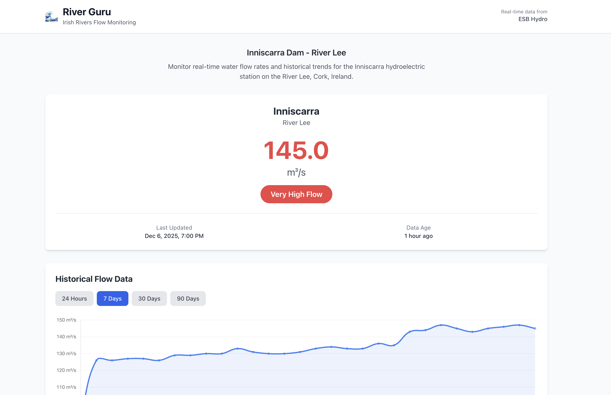

# Irish Rivers Data Scraper

A low-cost, serverless system for aggregating water data from Irish rivers, including flow rates from ESB Hydro and water level/temperature data from waterlevel.ie.

## Screenshots



*River Guru displays real-time data from Inniscarra Dam (flow) and Waterworks Weir (water level & temperature) with interactive historical charts*

## Features

- **Multiple Data Sources**: ESB Hydro flow data (PDF) and waterlevel.ie water level/temperature (CSV API)
- **7 Active Stations**: Inniscarra Dam, Lee Waterworks, Blackwater Fermoy, Blackwater Mallow, Suir Golden, Owenboy, Bandon Curranure
- **Serverless Architecture**: AWS Lambda (arm64, Python 3.13), minimal operating costs (<$5/month)
- **Hourly Data Collection**: EventBridge trigger at 30 minutes past the hour
- **River Guru Web App**: Mobile-first Vue.js SPA with real-time flow display and historical charts
- **SMS Flow Alerts**: Daily opt-in alerts via Amazon SNS when Inniscarra flow changes by >2 m³/s
- **Zero-Database Design**: All state (data + alert subscriptions) stored as JSON/CSV in S3

## Architecture

```
EventBridge (hourly)
       │
       ▼
Collector Lambda ──► S3 (raw PDFs/CSVs, parsed JSON, aggregated latest)
  • ESB Hydro PDF      │
  • waterlevel.ie API  └──► Amazon SNS SMS ──► Subscribers' phones
                                (flow change > 2 m³/s)

Users (browser)
       │ HTTPS
       ▼
API Gateway
  ├── GET /api/flow/latest   ──► Data API Lambda ──► S3
  ├── GET /api/flow/history  ──► Data API Lambda ──► S3
  ├── GET /api/flow/summary  ──► Data API Lambda ──► S3  (compact, for watch Shortcut)
  ├── POST /api/alerts/register ──► Alerts API Lambda ──► S3
  ├── POST /api/alerts/optin    ──► Alerts API Lambda ──► S3
  └── POST /api/alerts/status   ──► Alerts API Lambda ──► S3

Web App (Vue.js SPA) hosted on S3 static website
```

## Project Structure

```
river-data-scraper/
├── .github/workflows/deploy.yml  # CI/CD pipeline (push to main → production)
├── template.yaml                 # SAM/CloudFormation template
├── samconfig.toml                # SAM deploy configuration (no secrets)
├── Makefile                      # Build and deploy automation
├── config/data_sources.json      # Station config (uploaded to S3 on deploy)
├── requirements-collector.txt    # Collector Lambda deps (no boto3)
├── requirements-alerts.txt       # Alerts API Lambda deps (none — SNS via runtime boto3)
│
├── src/                          # Collector Lambda
│   ├── lambda_handler.py
│   ├── config/settings.py
│   ├── connectors/http_connector.py
│   ├── notifications/sms_notifier.py
│   ├── parsers/
│   │   ├── esb_hydro_parser.py
│   │   └── waterlevel_parser.py
│   ├── storage/s3_storage.py
│   └── utils/
│       ├── logger.py
│       └── retry.py
│
├── api/                          # API Lambdas
│   ├── data_api.py
│   ├── alerts_api.py
│   └── requirements.txt          # Data API deps (empty — boto3 from runtime)
│
└── web/                          # Vue.js web app
    └── src/
        ├── components/
        │   ├── FlowStatus.vue
        │   ├── FlowChart.vue
        │   ├── WaterLevelStatus.vue
        │   ├── WaterLevelChart.vue
        │   └── AlertSubscription.vue
        └── services/api.js
```

## Prerequisites

- Python 3.13
- AWS SAM CLI
- AWS CLI configured (`aws configure`)
- Node.js 18+ and npm (for the web app)

## Local Development

```bash
# Create virtual environment
python3 -m venv venv && source venv/bin/activate

# Install dev dependencies
pip install -r requirements-dev.txt

# Run tests
pytest tests/ -v
```

## Deployment

### CI/CD (Primary)

Pushing to `main` triggers a GitHub Actions pipeline (`.github/workflows/deploy.yml`):

1. **test** — runs `pytest tests/ -v`
2. **validate** — runs `sam validate --lint`
3. **deploy** — builds and deploys Lambda functions, then builds and deploys the web app

Auth uses OIDC federation with IAM role `github-actions-river-sage` — no long-lived AWS keys.

### Manual Deploy

For local deploys (e.g., debugging):

```bash
make deploy-prod   # builds and deploys everything
```

Or step by step:

```bash
sam build --no-cached
sam deploy --config-env production --no-confirm-changeset
cd web && npm install && npm run build
aws s3 sync dist/ s3://river-guru-web-production/ --region eu-west-1 --delete
```

### Secrets

SMS flow alerts are sent via **Amazon SNS** using the Lambda's IAM role (`sns:Publish`) — there are **no SMS credentials** to store. The only SSM parameter is the alarm-notification email, read at deploy time by the SNS alarm topic. No secrets are stored in source code, environment variables, or GitHub.

| SSM Path | Description |
|---|---|
| `/river-data-scraper/alert-email` | Email for CloudWatch alarm notifications |

To change the alarm email:
```bash
aws ssm put-parameter --name /river-data-scraper/alert-email \
  --value "new@example.com" --type String --region eu-west-1 --overwrite
# Redeploy to update the SNS topic subscription (this value resolves at deploy time)
```

## Production Environment

**Region**: `eu-west-1`  
**Stack**: `river-data-scraper-prod`

| Resource | Name |
|---|---|
| Collector Lambda | `river-data-scraper-collector` |
| Data API Lambda | `river-data-scraper-data-api` |
| Alerts API Lambda | `river-data-scraper-alerts-api` |
| Data S3 Bucket | `river-data-ireland-prod` |
| Web App S3 Bucket | `river-guru-web-production` |
| API Gateway | see CloudFormation output `RiverGuruApiUrl` |
| Web App | https://www.theriverguru.com |

**Useful commands:**

```bash
# Tail live logs
sam logs --tail --stack-name river-data-scraper-prod --region eu-west-1

# Manually trigger a collection run
aws lambda invoke --function-name river-data-scraper-prod-collector \
  --region eu-west-1 /tmp/response.json && cat /tmp/response.json | jq .

# Check latest data in S3
aws s3 cp s3://river-data-ireland-prod/aggregated/inniscarra_latest.json - | jq .

# Check stack status
aws cloudformation describe-stacks --stack-name river-data-scraper-prod \
  --region eu-west-1 --query 'Stacks[0].StackStatus'
```

## Apple Watch (River Lee flow)

See the live River Lee flow on your Apple Watch with an Apple **Shortcut** — no app to install. The Shortcut calls the public `GET /api/flow/summary` endpoint, which returns ready-to-display strings so the Shortcut needs no logic of its own:

- `card` — a multi-line card for the watch result sheet
- `spoken` — a clean phrase for Siri (no emoji/symbols)
- `display` — a single-line fallback

**Endpoint** (defaults to the River Lee / Inniscarra — no parameters needed):

```
https://3su2ubk6j2.execute-api.eu-west-1.amazonaws.com/production/api/flow/summary
```

Example `card` value:

```
🌊 River Lee
6.3 m³/s
⬆️ rising (last hr)
🕐 40m ago
```

### 1. Build the Shortcut (once, on your iPhone)

1. Open **Shortcuts** → tap **+** → rename it **"River Lee Flow"** (this name becomes your Siri phrase).
2. Add **Get Contents of URL** — set URL to the endpoint above, Method **GET**.
3. Add **Get Dictionary Value** — get **Value** for key **`card`** from *Contents of URL*.
4. Add **Show Result** → select the **Dictionary Value** from step 3.
5. *(Optional, for Siri voice)* add another **Get Dictionary Value** for key **`spoken`**, then **Speak Text** with it.

### 2. Enable it on the Watch

In the shortcut's settings (the ⓘ / Details panel), turn on **Show on Apple Watch** (and **Pin** if you like). It then appears in the **Shortcuts app on the watch**.

### 3. Add your triggers

- **Watch‑face complication** — Watch face → **Edit** → choose a complication slot → **Shortcuts** → **River Lee Flow**. Tapping it runs the Shortcut and shows the card. *(A complication can only launch the Shortcut on tap — watchOS can't render the live value on the face itself without a native app.)*
- **Siri** — raise your wrist and say **"Hey Siri, River Lee Flow"**.
- **Shortcuts app** — open Shortcuts on the watch and tap it.

### Other stations

Append `?station=<id>` for other gauges, e.g. `…/api/flow/summary?station=inniscarra`. The endpoint currently supports **flow** stations (the River Lee / `inniscarra`); the other gauges report water level/temperature rather than flow and aren't covered by this endpoint yet.

## Monitoring

Logs are structured JSON, queryable in CloudWatch Insights:

```
/aws/lambda/river-data-scraper-collector
/aws/lambda/river-data-scraper-data-api
/aws/lambda/river-data-scraper-alerts-api
```

Example query — find errors by station:
```sql
fields @timestamp, context.station_id, message
| filter level = "ERROR"
| sort @timestamp desc
```

CloudWatch Alarms for Lambda errors and throttles publish to an SNS topic that emails the address stored in `/river-data-scraper/alert-email` (SSM Parameter Store).

## Roadmap

- [x] ESB Hydro PDF parsing (Inniscarra Dam flow)
- [x] waterlevel.ie CSV integration (6 additional stations)
- [x] S3 storage (raw, parsed, aggregated)
- [x] River Guru web app (Vue.js, mobile-first)
- [x] API Gateway + Data API Lambda
- [x] SMS flow alerts (Amazon SNS, daily opt-in, threshold detection)
- [x] Alerts API Lambda + AlertSubscription component
- [ ] Additional waterlevel.ie stations
- [ ] Met Éireann rainfall correlation
- [x] Raw file S3 lifecycle (Glacier at 90 days, expire at 365 days)
- [x] Apple Watch / watchOS Shortcuts endpoint (`GET /api/flow/summary`)

## License

Creative Commons Attribution-NonCommercial 4.0 International (CC BY-NC 4.0) — see [LICENSE](LICENSE).

## Data Attribution

Water level and temperature data from [waterlevel.ie](https://waterlevel.ie/), provided by the Office of Public Works (OPW) under [CC BY 4.0](https://creativecommons.org/licenses/by/4.0/).

Flow data courtesy of [ESB Hydro](http://www.esbhydro.ie/).
